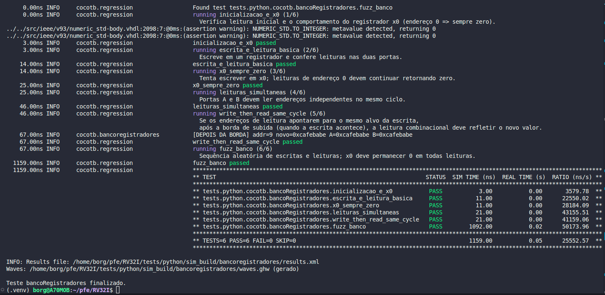
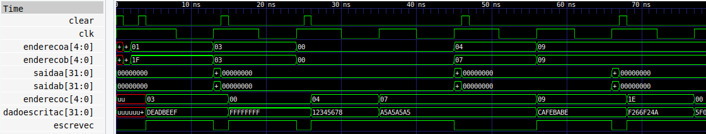

# RISC-V Processor (RV32I) — VHDL + Automated Testing

**Authors:** [Ilana Finger](https://github.com/ilacftemp), [Leonardo Paloschi](), [Lucas Lima](https://github.com/lucasouzamil) e [Pedro Ventura](https://github.com/pedropcventura).
**Advisor:** [Rafael Corsi](https://github.com/rafaelcorsi).

This repository implements, in **VHDL**, a processor based on the **RV32I instruction set** (32-bit RISC-V).
The focus is on **architecture implementation and verification**: in addition to the hardware itself, the project provides a **simulation infrastructure with Cocotb** (Python) and **Quartus projects** for FPGA testing.

## Project Overview

* **Architecture**: RV32I (32-bit integers).
* **Typical blocks**: register bank, ALU, immediate generator, simple ROM/RAM, control unit, and the *top* `riscv.vhd`.
* **Verification**: automated tests in **Cocotb** (Python testing library) with **GHDL** (VHDL simulator). Simulation waveforms can be opened in **GTKWave**.
* **FPGA**: **Quartus projects** for synthesis and practical experiments (target board used: *Cyclone V: 5CEBA4F23C7 (the FPGA on the DE0-CV board)*).


## Repository Structure (function of each folder)

```
.
├── quartus/        # Main Quartus project for the processor (FPGA)
├── src/            # VHDL modules used by the Quartus project and in tests
└── tests/          # Verification tests (simulation + FPGA projects for modules)
    ├── FPGA/       # Small Quartus projects to test modules separately
    └── python/     # Cocotb tests (simulated), runner, and simulation artifacts
```

### `quartus/`

Where the **main FPGA project** is located. This is where you open in Quartus, configure pins, compile, and generate the bitstream. Uses the modules from `src/`.

### `src/`

All **VHDL modules** of the processor (register bank, ALU, control unit, etc.).
These files are included in the **Quartus project** and are also **targets for simulation tests**.

### `tests/`

Brings together two verification fronts:

* `tests/FPGA/`: **support Quartus projects** to test **isolated modules** directly on the FPGA (useful for debugging blocks outside the complete processor).
* `tests/python/`: where the **Cocotb testbenches** (Python), the **runner**, and **simulation artifacts** are located.

  * `unittests/`: **Python tests** (each file tests a VHDL module/entity).
  * `utils/runner.py`: **orchestrates** compilation and simulation (reads the `tests.json` catalog).
  * `tests.json`: **test catalog**, mapping each test to the VHDL *toplevel* and required modules/entities.
  * `sim_build/<toplevel>/`: **simulation output** for the respective *toplevel* test (e.g., `results.xml`, `waves.ghw` to open in GTKWave).

  > To learn more about the simulated tests, check the [README in `tests/python/`](tests/python/README.md)

## Dependencies

### System (Ubuntu/Debian)

```bash
sudo apt update
sudo apt install ghdl gtkwave
```

* **GHDL**: VHDL simulator — compiles and runs `.vhd` files for Cocotb tests.
* **GTKWave**: waveform viewer — opens `.ghw` files generated in simulation (useful for debugging signals).

### Python

Use a virtual environment to isolate dependencies:

```bash
python3 -m venv .venv
source .venv/bin/activate
pip install -r requirements.txt
```

The `requirements.txt` includes **Cocotb** (Python test framework for HDL projects).

> Summary: **GHDL** runs the simulation, **Cocotb** writes/verifies tests, **GTKWave** shows the waveforms.


## Running a Simulated Test

Tests are launched by the runner:

```bash
# from the repository root (with the venv active)
python3 tests/python/utils/runner.py           # runs all tests in the catalog
python3 tests/python/utils/runner.py bancoRegistradores   # runs a specific test
```

* The runner reads `tests/python/tests.json`, compiles the indicated **sources**, and runs the **Cocotb tests**.
* The output of each *toplevel* goes to `tests/python/sim_build/<toplevel>/`, including:

  * `results.xml`: xUnit report
  * `waves.ghw`: **simulation waveforms** (open with `gtkwave`)

Example of a test log (bancoRegistradores):


Example to open waveforms:

```bash
gtkwave tests/python/sim_build/bancoregistradores/waves.ghw
```

Example of test waveforms (bancoRegistradores):


> To **create new tests** (such as adding entries in `tests.json`, folder patterns),