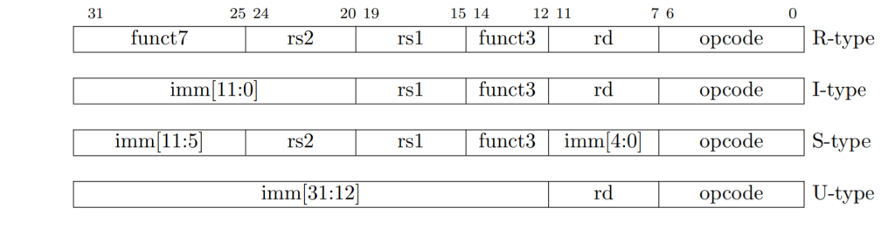
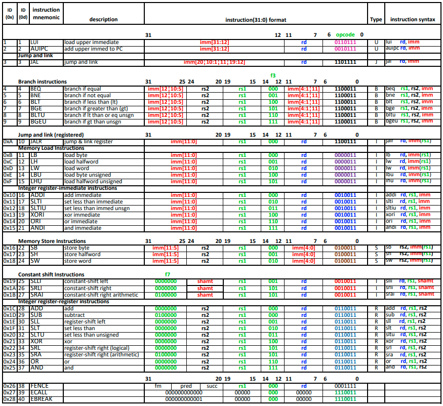
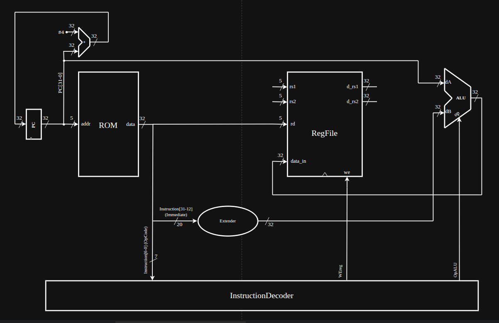
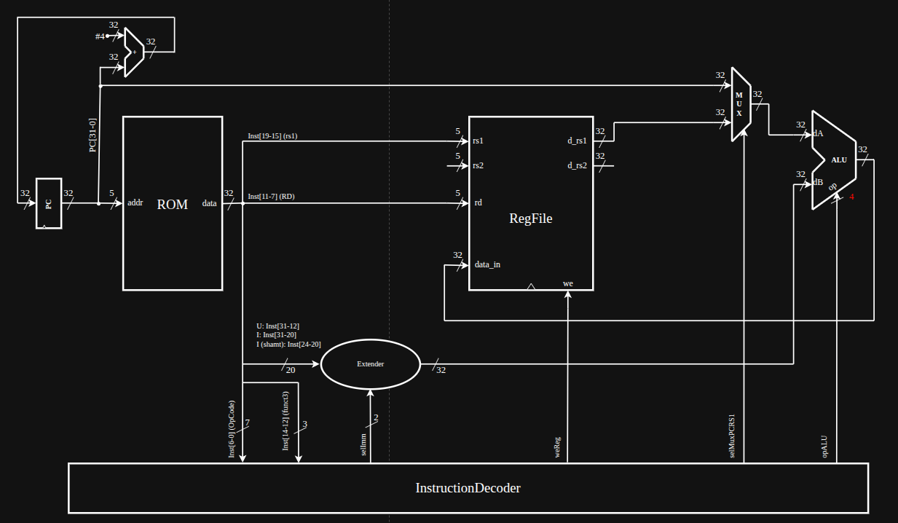
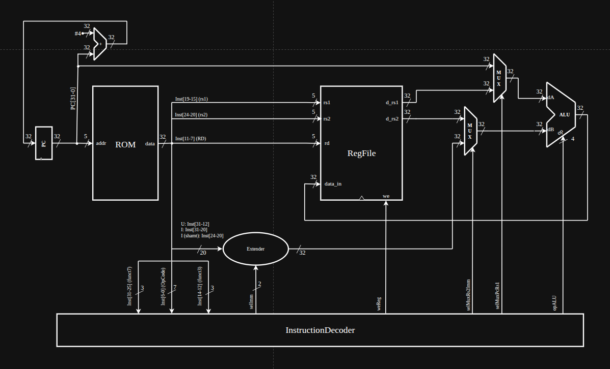

# Implementação das intruções da ISA RV32I

Após o teste dos componentes necessários para executar instruções como o Banco de Registradores, memória RAM e memória RAM, é hora de começar a implementar as intruçẽs.

Observando a [o green card do RISC-V](instructions/greencardRISCV.pdf) nota-se que a ISA RV32I define **6 formatos básicos (*R, I, S, B, U, J*)** (mais as instruções de sistema). Cada formato especifica como os 32 bits da instrução são divididos em **campos** (opcode, registradores, imediato etc.). Esse conjunto forma o núcleo mínimo da arquitetura, sendo 10 dela instruções para DEBUG.

## Descrição dos tipos

* **R-type** → Utilizado para operações entre dois registradores, gerando um resultado armazenado em outro registrador.
* **I-type** → Formato que trabalha com valores imediatos (constantes embutidas na instrução) ou acessos diretos à memória.
* **S-type** → Usado para armazenar valores de registradores em posições de memória.
* **B-type** → Responsável por instruções de desvio condicional, alterando o fluxo de execução de acordo com comparações entre registradores.
* **U-type** → Manipula valores constantes de 20 bits, normalmente posicionados em campos superiores de registradores.
* **J-type** → Formato voltado para desvios incondicionais, permitindo mudanças no fluxo de execução para endereços relativos ao PC.
* **System/CSR** → Instruções especiais para controle do sistema, sincronização e acesso a registradores de status e configuração.

### Formato geral dos tipos

### Formato individual das instruções

# Transferindo para o hardware

A implementação das instruções em hardware foi conduzida de forma incremental, adicionando cada instrução gradualmente. Dessa maneira, novas funcionalidades, módulos e comportamentos foram incorporados apenas quando necessários.

## Plano incremental RV32I (Sem intruções de debug)

### Etapa 1 — U-type sem mudar o PC

1. **LUI**
2. **AUIPC**

### Etapa 2 — I-type aritmético/lógico (sem desvio)

3. **ADDI** (padrão ouro para testar sign-extend I)
4. **XORI / ORI / ANDI**
5. **SLTI / SLTIU** (comparadores na ULA)
6. **SLLI / SRLI / SRAI** (shift com `shamt` de 5 bits)

### Etapa 3 — R-type completo

7. **ADD / SUB**
8. **XOR / OR / AND**
9. **SLL / SRL / SRA**
10. **SLT / SLTU**

### Etapa 4 — Saltos (mexe no PC, mas simples)

11. **JAL**
12. **JALR**

### Etapa 5 — Branches (controle condicional no PC)

13. **BEQ / BNE**
14. **BLT / BGE**
15. **BLTU / BGEU**

### Etapa 6 — Loads/Stores (dados da memória)

16. **LW** 
17. **SW** 
18. **LH/LHU, LB/LBU** 
19. **SH/SB** → **byte-enable**

## Por que essa ordem?

1. **Etapas 1–3 (LUI/AUIPC, I-type, R-type)**

   * Essas instruções **não alteram o fluxo do PC** (o PC continua `pc+4` sempre).
   * Isso permite implementar os blocos básicos: **decodificador, unidade de imediatos, ULA, banco de registradores e writeback**.
   * A complexidade do controle fica baixa, pois não há dependência de desvios nem saltos.

2. **Etapas 4–5 (JAL/JALR e Branches)**

   * Depois de estabilizar operações aritméticas/lógicas, adiciona-se a lógica de **controle de fluxo**.
   * Primeiro os saltos **incondicionais** (JAL, JALR), que exigem apenas mudar o PC com base no imediato.
   * Só depois os **branches condicionais**, que além do cálculo do offset dependem de **comparação de registradores**.
   * Essa ordem garante que os muxes e controles de PC sejam introduzidos **aos poucos**, evitando bugs difíceis de rastrear.

3. **Etapa 6 (Loads/Stores)**

   * Acesso à memória é mais delicado: exige novos blocos como **sign/zero-extend de dados**, **byte-enable** e **geração de endereços**.
   * Colocar essa etapa depois dos saltos garante que já exista um datapath sólido, minimizando problemas quando conecta a RAM.

### Resumo

* **Valida o básico primeiro** (decodificação, ULA, imediatos, registradores).
* **Adiciona controle de fluxo gradualmente**, começando pelo mais simples (JAL) até o mais complexo (branches).
* **Só depois trata memória**, que envolve detalhes adicionais (tamanho, alinhamento, máscaras).

# Implementando o fluxo de dados (Incrementando a cada etapa)

## 1. U-type sem mudar o PC

| Instrução | 31-25 (funct7 / imm) | 24-20 (rs2 / shamt) | 19-15 (rs1) | 14-12 (funct3) | 11-7 (rd) | 6-0 (opcode) | Formato (assembly) | Implementação | Descrição |
|-----------|-----------------------|---------------------|-------------|----------------|-----------|--------------|--------------------|---------------|-----------|
| **LUI**   | imm[31:12]            |                     |             |                | rd        | 0110111      | `lui rd, imm`      | `x[rd] = sext(imm << 12)`        | Carrega imediato superior (U-type) |
| **AUIPC** | imm[31:12]            |                     |             |                | rd        | 0010111      | `auipc rd, imm`    | `x[rd] = pc + sext(imm << 12)`   | Soma imediato ao PC (U-type) |

### Fluxo de dados

## 2. I-type aritmético/lógico (sem desvio)

| Instrução | 31-25 (funct7 / imm) | 24-20 (rs2 / shamt) | 19-15 (rs1) | 14-12 (funct3) | 11-7 (rd) | 6-0 (opcode) | Formato (assembly)      | Implementação                  | Descrição                        |
|-----------|-----------------------|---------------------|-------------|----------------|-----------|--------------|-------------------------|---------------------------------|----------------------------------|
| **ADDI**  | imm[11:0]             |                     | rs1         | 000            | rd        | 0010011      | `addi rd, rs1, imm`     | `x[rd] = x[rs1] + sext(imm)`    | Soma imediato (I-type)           |
| **XORI**  | imm[11:0]             |                     | rs1         | 100            | rd        | 0010011      | `xori rd, rs1, imm`     | `x[rd] = x[rs1] ^ sext(imm)`    | XOR imediato (I-type)            |
| **ORI**   | imm[11:0]             |                     | rs1         | 110            | rd        | 0010011      | `ori rd, rs1, imm`      | `x[rd] = x[rs1] \| sext(imm)`   | OR imediato (I-type)             |
| **ANDI**  | imm[11:0]             |                     | rs1         | 111            | rd        | 0010011      | `andi rd, rs1, imm`     | `x[rd] = x[rs1] & sext(imm)`    | AND imediato (I-type)            |
| **SLLI**  | 0000000               | shamt[4:0]          | rs1         | 001            | rd        | 0010011      | `slli rd, rs1, shamt`   | `x[rd] = x[rs1] << shamt`       | Shift lógico à esquerda (I-type) |
| **SRLI**  | 0000000               | shamt[4:0]          | rs1         | 101            | rd        | 0010011      | `srli rd, rs1, shamt`   | `x[rd] = x[rs1] >>u shamt`      | Shift lógico à direita (I-type)  |
| **SRAI**  | 0100000               | shamt[4:0]          | rs1         | 101            | rd        | 0010011      | `srai rd, rs1, shamt`   | `x[rd] = x[rs1] >>s shamt`      | Shift aritmético à direita       |

### Fluxo de dados

## 3. R-type completo

| Instrução | 31-25 (funct7) | 24-20 (rs2) | 19-15 (rs1) | 14-12 (funct3) | 11-7 (rd) | 6-0 (opcode) | Formato (assembly)      | Implementação                     | Descrição                           |
|-----------|----------------|-------------|-------------|----------------|-----------|--------------|-------------------------|------------------------------------|-------------------------------------|
| **ADD**   | 0000000        | rs2         | rs1         | 000            | rd        | 0110011      | `add rd, rs1, rs2`      | `x[rd] = x[rs1] + x[rs2]`          | Soma entre registradores            |
| **SUB**   | 0100000        | rs2         | rs1         | 000            | rd        | 0110011      | `sub rd, rs1, rs2`      | `x[rd] = x[rs1] - x[rs2]`          | Subtração entre registradores       |
| **XOR**   | 0000000        | rs2         | rs1         | 100            | rd        | 0110011      | `xor rd, rs1, rs2`      | `x[rd] = x[rs1] ^ x[rs2]`          | OU-exclusivo bit a bit              |
| **OR**    | 0000000        | rs2         | rs1         | 110            | rd        | 0110011      | `or rd, rs1, rs2`       | `x[rd] = x[rs1] \| x[rs2]`         | OU bit a bit                        |
| **AND**   | 0000000        | rs2         | rs1         | 111            | rd        | 0110011      | `and rd, rs1, rs2`      | `x[rd] = x[rs1] & x[rs2]`          | E bit a bit                         |
| **SLL**   | 0000000        | rs2         | rs1         | 001            | rd        | 0110011      | `sll rd, rs1, rs2`      | `x[rd] = x[rs1] << x[rs2][4:0]`    | Deslocamento lógico à esquerda      |
| **SRL**   | 0000000        | rs2         | rs1         | 101            | rd        | 0110011      | `srl rd, rs1, rs2`      | `x[rd] = x[rs1] >>u x[rs2][4:0]`   | Deslocamento lógico à direita       |
| **SRA**   | 0100000        | rs2         | rs1         | 101            | rd        | 0110011      | `sra rd, rs1, rs2`      | `x[rd] = x[rs1] >>s x[rs2][4:0]`   | Deslocamento aritmético à direita   |
| **SLT**   | 0000000        | rs2         | rs1         | 010            | rd        | 0110011      | `slt rd, rs1, rs2`      | `x[rd] = (x[rs1] <s x[rs2]) ? 1:0` | Menor que (comparação com sinal)    |
| **SLTU**  | 0000000        | rs2         | rs1         | 011            | rd        | 0110011      | `sltu rd, rs1, rs2`     | `x[rd] = (x[rs1] <u x[rs2]) ? 1:0` | Menor que (comparação sem sinal)    |

### Fluxo de dados

## 4. Saltos (mexe no PC, mas simples)

| Instrução | 31-25 (funct7/imm) | 24-20 (rs2/shamt/imm) | 19-15 (rs1) | 14-12 (funct3) | 11-7 (rd) | 6-0 (opcode) | Formato (assembly)   | Implementação                                           | Descrição                          |
|-----------|---------------------|-----------------------|-------------|----------------|-----------|--------------|----------------------|---------------------------------------------------------|------------------------------------|
| **JAL**   | imm[20\|10:5]       | imm[4:1\|11]          | imm[19:15]  | imm[14:12]     | rd        | 1101111      | `jal rd, off`        | `x[rd] = pc + 4; pc = pc + sext(off)`                   | Salto relativo ao PC (J-type)      |
| **JALR**  | imm[11:5]           | imm[4:0]              | rs1         | 000            | rd        | 1100111      | `jalr rd, rs1, off`  | `t = pc + 4; pc = (x[rs1] + sext(off)) & ~1; x[rd] = t` | Salto indireto via `rs1` (I-type)  |

### Fluxo de dados

## 5. Branches (controle condicional no PC)

| Instrução | 31-25 (imm[12\|10:5]) | 24-20 (rs2) | 19-15 (rs1) | 14-12 (funct3) | 11-7 (imm[4:1\|11]) | 6-0 (opcode) | Formato (assembly)       | Implementação                                   | Descrição                           |
|-----------|------------------------|-------------|-------------|----------------|----------------------|--------------|--------------------------|-----------------------------------------------|-------------------------------------|
| **BEQ**   | imm[12\|10:5]          | rs2         | rs1         | 000            | imm[4:1\|11]         | 1100011      | `beq rs1, rs2, off`      | `if (x[rs1] ==  x[rs2]) pc += sext(off)`       | Desvio se iguais (signed)           |
| **BNE**   | imm[12\|10:5]          | rs2         | rs1         | 001            | imm[4:1\|11]         | 1100011      | `bne rs1, rs2, off`      | `if (x[rs1] !=  x[rs2]) pc += sext(off)`       | Desvio se diferentes                 |
| **BLT**   | imm[12\|10:5]          | rs2         | rs1         | 100            | imm[4:1\|11]         | 1100011      | `blt rs1, rs2, off`      | `if (x[rs1] <s  x[rs2]) pc += sext(off)`       | Menor que (comparação com sinal)    |
| **BGE**   | imm[12\|10:5]          | rs2         | rs1         | 101            | imm[4:1\|11]         | 1100011      | `bge rs1, rs2, off`      | `if (x[rs1] >=s x[rs2]) pc += sext(off)`       | Maior/igual (comparação com sinal)  |
| **BLTU**  | imm[12\|10:5]          | rs2         | rs1         | 110            | imm[4:1\|11]         | 1100011      | `bltu rs1, rs2, off`     | `if (x[rs1] <u  x[rs2]) pc += sext(off)`       | Menor que (sem sinal)               |
| **BGEU**  | imm[12\|10:5]          | rs2         | rs1         | 111            | imm[4:1\|11]         | 1100011      | `bgeu rs1, rs2, off`     | `if (x[rs1] >=u x[rs2]) pc += sext(off)`       | Maior/igual (sem sinal)             |

### Fluxo de dados

## 6. Loads/Stores (dados da memória)

| Instrução | 31-25 (imm[11:5]) | 24-20 (rs2 / imm[4:0]) | 19-15 (rs1) | 14-12 (funct3) | 11-7 (rd / imm[4:0]) | 6-0 (opcode) | Formato (assembly)      | Implementação                                           | Descrição                                 |
|-----------|--------------------|------------------------|-------------|----------------|----------------------|--------------|-------------------------|---------------------------------------------------------|-------------------------------------------|
| **LW**    | imm[11:5]          | imm[4:0]              | rs1         | 010            | rd                   | 0000011      | `lw rd, off(rs1)`       | `x[rd] = sext(M[x[rs1] + sext(off)][31:0])`            | Load word (32 bits), sign-extend          |
| **LH**    | imm[11:5]          | imm[4:0]              | rs1         | 001            | rd                   | 0000011      | `lh rd, off(rs1)`       | `x[rd] = sext(M[x[rs1] + sext(off)][15:0])`            | Load halfword (16b), sign-extend          |
| **LHU**   | imm[11:5]          | imm[4:0]              | rs1         | 101            | rd                   | 0000011      | `lhu rd, off(rs1)`      | `x[rd] =     (M[x[rs1] + sext(off)][15:0])`            | Load halfword (16b), zero-extend          |
| **LB**    | imm[11:5]          | imm[4:0]              | rs1         | 000            | rd                   | 0000011      | `lb rd, off(rs1)`       | `x[rd] = sext(M[x[rs1] + sext(off)][7:0])`             | Load byte (8b),  sign-extend              |
| **LBU**   | imm[11:5]          | imm[4:0]              | rs1         | 100            | rd                   | 0000011      | `lbu rd, off(rs1)`      | `x[rd] =     (M[x[rs1] + sext(off)][7:0])`             | Load byte (8b),  zero-extend              |
| **SW**    | imm[11:5]          | rs2                   | rs1         | 010            | imm[4:0]             | 0100011      | `sw rs2, off(rs1)`      | `M[x[rs1] + sext(off)] = x[rs2][31:0]`                 | Store word (32 bits)                      |
| **SH**    | imm[11:5]          | rs2                   | rs1         | 001            | imm[4:0]             | 0100011      | `sh rs2, off(rs1)`      | `M[x[rs1] + sext(off)] = x[rs2][15:0]`                 | Store halfword (16 bits)                  |
| **SB**    | imm[11:5]          | rs2                   | rs1         | 000            | imm[4:0]             | 0100011      | `sb rs2, off(rs1)`      | `M[x[rs1] + sext(off)] = x[rs2][7:0]`                  | Store byte (8 bits) — *byte-enable*       |

### Fluxo de dados
