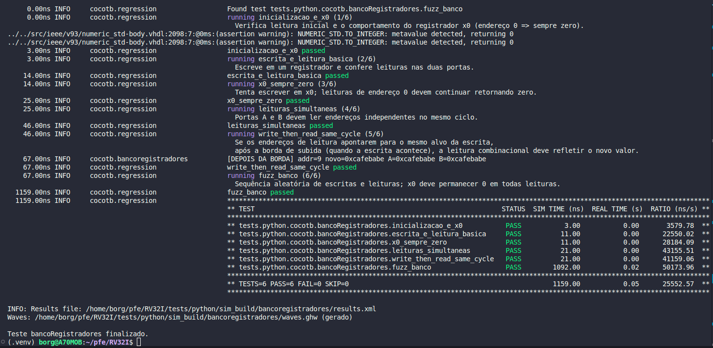
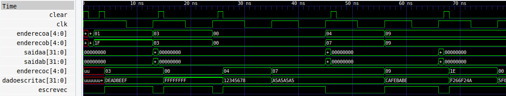

# `tests/python` — Test Guide (Cocotb + GHDL)

Here are the **simulation tests** written in **Python** using **Cocotb** and the **runner** that compiles/runs everything with **GHDL**. This is also where the **waveforms** for **GTKWave** are stored.

## What’s here

```
tests/python/
├── cocotb/           # Python tests (one file per VHDL module)
│   └── ...           # e.g.: bancoRegistradores.py, examples/and_gate.py, etc.
├── utils/
│   └── runner.py     # script that compiles VHDL + runs tests
├── tests.json        # catalog: registry of tests that can be executed
└── sim_build/
    └── <toplevel>/   # simulation outputs (results.xml, waves.ghw, etc.)
```

* **`cocotb/`**: each `.py` contains one or more `@cocotb.test()`.
* **`tests.json`**: registers *test name* → (*VHDL toplevel*, *VHDL files*, *Python module*).
* **`sim_build/<toplevel>/`**: simulation output; this is where `waves.ghw` is generated.


## Creating a new test

### 1) Write the testbench in `cocotb/`

Create `tests/python/cocotb/my_module.py`:

```python
# tests/python/cocotb/my_module.py
import cocotb
from cocotb.clock import Clock
from cocotb.triggers import RisingEdge, Timer

@cocotb.test()
async def basic(dut):
    ...
```

### 2) Register it in `tests.json`

Open `tests/python/tests.json` and add a block:

```json
{
  "my_module": {
    "toplevel": "myentity",                 // VHDL entity (exact name, lowercase!)
    "sources": [
      "src/DependencyA.vhd",
      "src/DependencyB.vhd",
      "src/MyEntity.vhd"
    ],
    "test_module": "tests.python.cocotb.my_module"          
  }
}
```

**Fields:**

* `toplevel`: the name of the **VHDL entity** you want to simulate.
* `sources`: **all** required `.vhd` files (the entity + dependencies).

  > Use paths **relative to the repository root** (e.g.: `src/...`).
* `test_module`: Python path to the file, relative to the project root, separated by dots (e.g.: `tests.python.cocotb.my_module`).

## Running

Run with the virtual environment active, from the **root of the repo**:

* **All tests** in the catalog:

  ```bash
  python3 tests/python/utils/runner.py
  # or
  python3 tests/python/utils/runner.py all
  ```

* **A specific test**:

  ```bash
  python3 tests/python/utils/runner.py my_module
  ```

Output (per test):  
`tests/python/sim_build/<toplevel>/results.xml` + `waves.ghw` (waveforms).

Example of a test log (Register File):



## Viewing waveforms (GTKWave)

Each run generates `waves.ghw` in `sim_build/<toplevel>/`:

```bash
gtkwave tests/python/sim_build/<entity>/waves.ghw
```

Tips:

* Add signals from the DUT (e.g.: `clk`, `escreveC`, addresses, data, and outputs).
* Save a `.sav` layout in the same directory to reuse your signal selection.

Example of test waveforms (bancoRegistradores):

